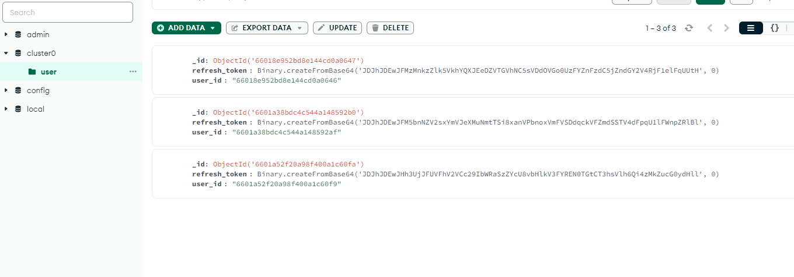

## Примечание
На локальной машине должен быть запущен MongoDB по адресу http://localhost:27017

# Проверка требований
[Полное описание ТЗ](https://medods.notion.site/Test-task-BackDev-215fcddafff2425a8ca7e515e21527e7)

### 1. Access токен тип JWT, алгоритм SHA512, хранить в базе строго запрещено.

Access токен не хранится в базе данных.

Что касается базы данных: в ней хранится 1 коллекция users, которая содержит документы со структурой id, rf_token_hash:



### 2. Refresh токен тип произвольный, формат передачи base64, хранится в базе исключительно в виде bcrypt хеша, должен быть защищен от изменения на стороне клиента и попыток повторного использования.

Функция по генерации соответствующего типа токена и Refresh токена

В качестве Refsresh токена используется случайный набор 32-ух байт. Ниже представлена функция для генерации токена и его хеширования в bcrypt


```go

 func GenerateAllTokens(uid string) (signedToken string, signedRefreshToken []byte, err error) {
	claims := &SignedDetails{
		Refresh_token: signedRefreshToken,
		Uid : uid,
		StandardClaims: jwt.StandardClaims{
			ExpiresAt: time.Now().Local().Add(time.Hour * time.Duration(24)).Unix(),
		},
	}

	token ,err := jwt.NewWithClaims(jwt.SigningMethodHS512, claims).SignedString([]byte(SECRET_KEY))
    if err != nil {
		log.Panic(err)
		return 
	}

	randomBytes := make([]byte, 32)
	if _, err := rand.Read(randomBytes); err != nil {
		panic(err)
	}

	refreshToken, err := bcrypt.GenerateFromPassword(randomBytes, bcrypt.DefaultCost)
	if err != nil {
		return 
	}

	return token, refreshToken, err
 }

```

Хеш токена хранится в базе данных в формате base64, но уже с явным преобразованием в коде. Функция для обновления хеша в БД и преобразования его в формат base64:

```go
func UpdateAllTokens(signedToken string, signedRefreshToken []byte, userId string){
	var ctx, cancel = context.WithTimeout(context.Background(), 100*time.Second)

	var updateObj primitive.D

	updateObj = append(updateObj, bson.E{"token", signedToken})

	res := base64.StdEncoding.EncodeToString(signedRefreshToken)
	updateObj = append(updateObj, bson.E{Key: "refresh_token", Value: res})
	
	Updated_at, _ := time.Parse(time.RFC3339, time.Now().Format(time.RFC3339))
	updateObj = append(updateObj, bson.E{"updated_at", Updated_at})

	upsert := true
	filter := bson.M{"user_id":userId}
	opt := options.UpdateOptions{
		Upsert: &upsert,
	}

	_, err := userCollection.UpdateOne(
		ctx,
		filter,
		bson.D{
			{"$set", updateObj},
		},
		&opt,
	)

	defer cancel()

	if err!=nil{
		log.Panic(err)
		return
	}
	return
}
```

### 3. Access, Refresh токены обоюдно связаны, Refresh операцию для Access токена можно выполнить только тем Refresh токеном который был выдан вместе с ним.

Связанность достигается за счет указания bcrypt хеша Refresh токена в полезной нагрузке Access токена. Сервер после проверки подлинности Access токена также проверяет, что хеш из payload сопоставляется с присланным Refresh токеном.

```go

func ValidateToken(signedToken string) (claims *SignedDetails, msg string){
	token, err := jwt.ParseWithClaims(
		signedToken,
		&SignedDetails{},
		func(token *jwt.Token)(interface{}, error){
			return []byte(SECRET_KEY), nil
		},
	)
	
	if err != nil {
		msg=err.Error()
		return
	}

	var rfTokenHash models.TokenClaims
    var rfToken models.TokensPair

	claims, ok:= token.Claims.(*SignedDetails)
	if !ok{
		msg = fmt.Sprintf("the token is invalid")
		msg = err.Error()
		return
	}else if bcrypt.CompareHashAndPassword(rfTokenHash.Refresh_token, rfToken.Refresh_token) != nil {
		msg = fmt.Sprintf("invalid refresh token")
		msg = err.Error()
		return
	} else if !IsHashExistsInDB(rfTokenHash.Refresh_token) {
        msg = fmt.Sprintf( "no such refresh token in db")
		msg = err.Error()
        return
    }

	if claims.ExpiresAt < time.Now().Local().Unix(){
		msg = fmt.Sprintf("token is expired")
		msg = err.Error()
		return
	}
	return claims, msg
}

```